<div align="center">


# AI Travel Planner

**An intelligent travel OS — generate, refine, budget, share, and print complete AI-crafted itineraries.**

[](https://nextjs.org)
[](https://react.dev)
[](https://www.typescriptlang.org)
[](https://tailwindcss.com)
[](https://vitest.dev)
[](https://playwright.dev)
[](LICENSE)

</div>

---

## 📖 Overview

AI Travel Planner turns a short questionnaire into a **fully personalized, day-by-day itinerary** — generated by a large language model, editable with natural language, enriched with live weather, and shareable with a revocable link.

Built on the Next.js App Router with a strict TypeScript core, the app treats AI output as a *data contract*: the generator and a "surgical editor" share one JSON schema, so edits are precise, lossless, and always renderable.

**Core ideas**

- **AI as a data contract** — one shared itinerary schema drives generation, editing, validation, and rendering.
- **Surgical editing** — natural-language commands (`"More nightlife"`, `"Remove hiking"`) apply precise, lossless edits to an existing trip.
- **Honest by design** — prices are always approximate ranges, weather is never fabricated, and questionnaire data never leaves the browser.
- **Guest-first UX** — the entire core product runs with **zero configuration**: no sign-up, no database, no API keys for maps or weather.

---

## ✨ Features

| Feature | Description |
|---|---|
| 🧭 **AI Itinerary Generator** | 9-step questionnaire → complete trip: daily plan, activities with coordinates, accommodations, restaurants, packing checklist, emergency contacts, hidden gems, local customs |
| ✏️ **Surgical Itinerary Editor** | Natural-language edits that preserve everything the command doesn't touch |
| 💬 **AI Travel Assistant** | Conversational chat for itinerary changes and travel advice |
| 💰 **Budget Planner** | Canonical 6-category budget model — AI estimates rolled into consistent ranges, with derived fallbacks and savings suggestions |
| 🌤️ **Live Weather** | Open-Meteo integration with WMO-code mapping, 16-day forecast, and travel advice derived server-side |
| 🗺️ **Route Map** | Leaflet + OpenStreetMap plotting every activity, stay, restaurant, and hidden gem with valid coordinates |
| 🔗 **Trip Sharing** | Public share links with **view/edit modes**, secret revoke keys, 400 KB payload cap, and per-IP throttling |
| 📄 **Travel Report** | Print-optimized, PDF-ready trip summary |
| ⭐ **Favorites & History** | Per-trip favorites and activity history (cloud-backed when signed in) |
| 🔐 **Auth (pluggable)** | Google/GitHub OAuth via Supabase with a guest mode — runs fully offline without configuration |
| 🌙 **Design system** | Dark glassmorphism UI, brand compass mark, motion design, skeletons, empty states, print styles |

---

## 📸 Screenshots

> All captures below are real browser screenshots produced by `npm run screenshots` (Playwright against a live dev server, seeded with a complete 7-day Tokyo itinerary).

### Core experience

| Home | Questionnaire | Itinerary |
|:---:|:---:|:---:|
| 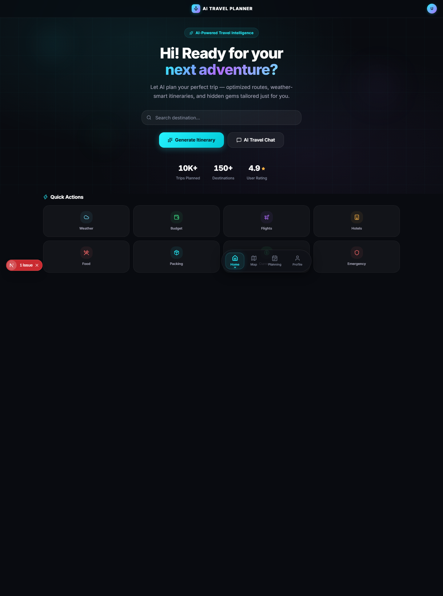 | 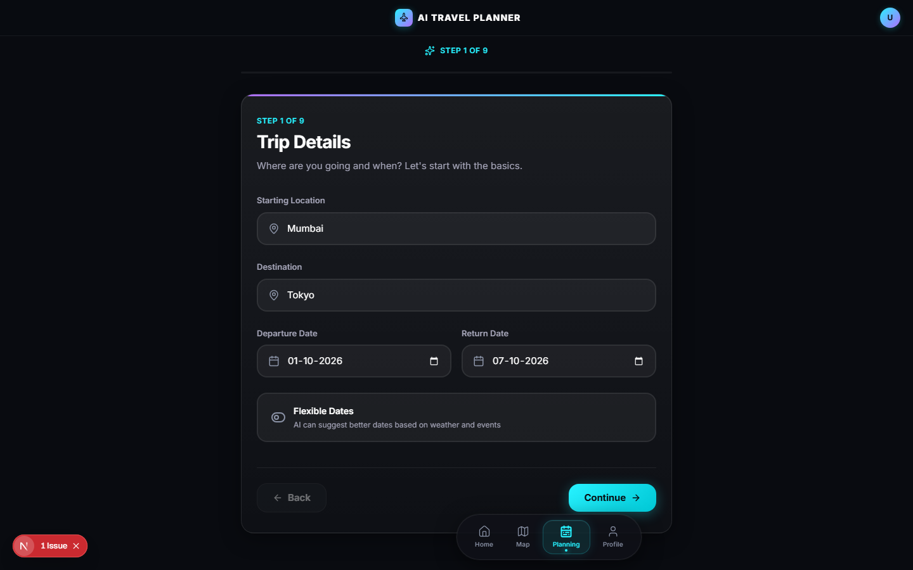 | 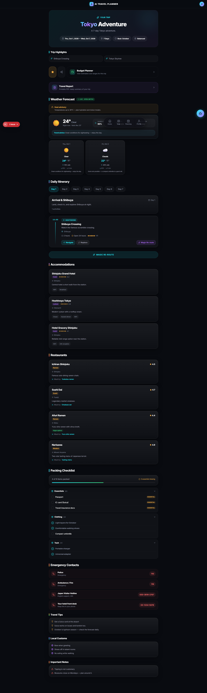 |

| Budget Planner | Route Map | Travel Report |
|:---:|:---:|:---:|
| 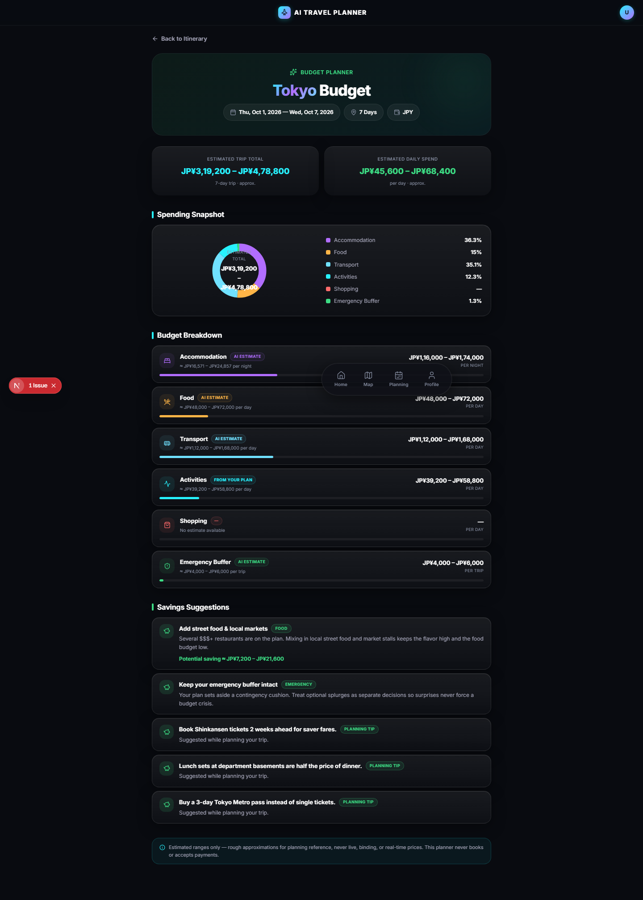 | 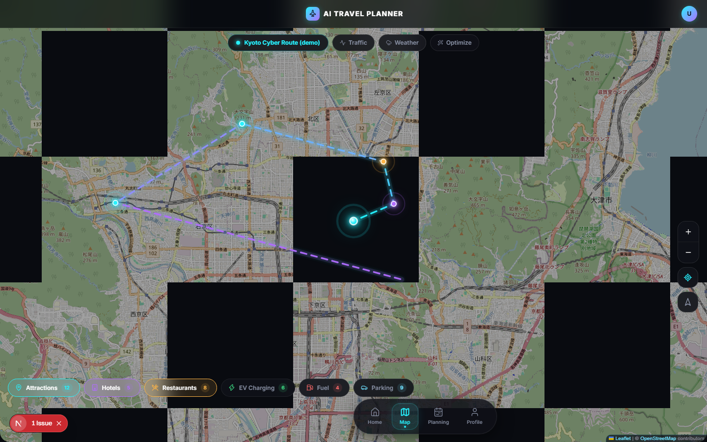 | 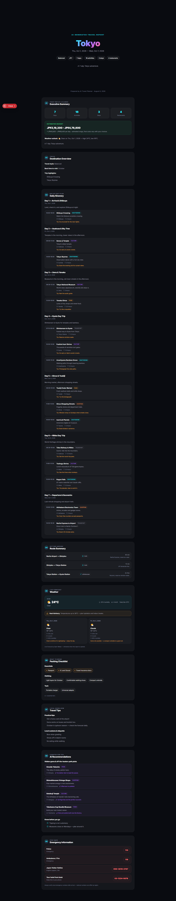 |

| Share Link | Profile | Mobile Itinerary |
|:---:|:---:|:---:|
| 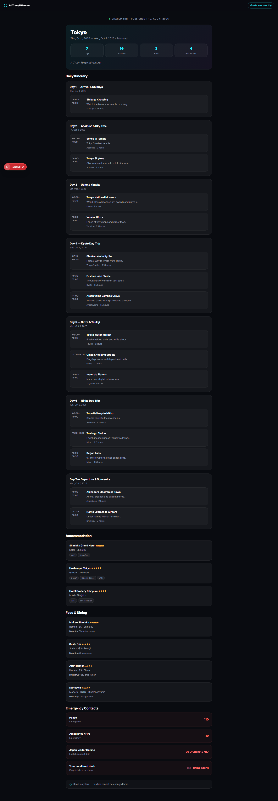 | 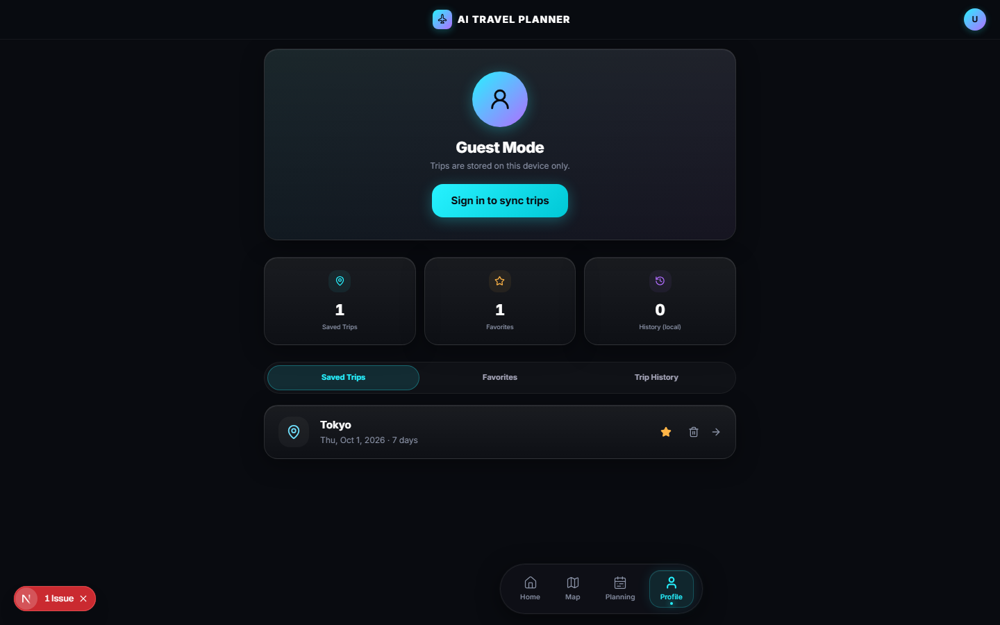 | 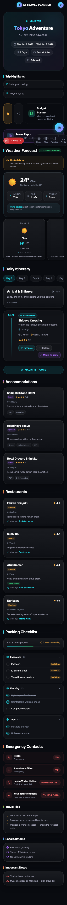 |

### States & flows

| AI Loading | Empty State | Error State |
|:---:|:---:|:---:|
| 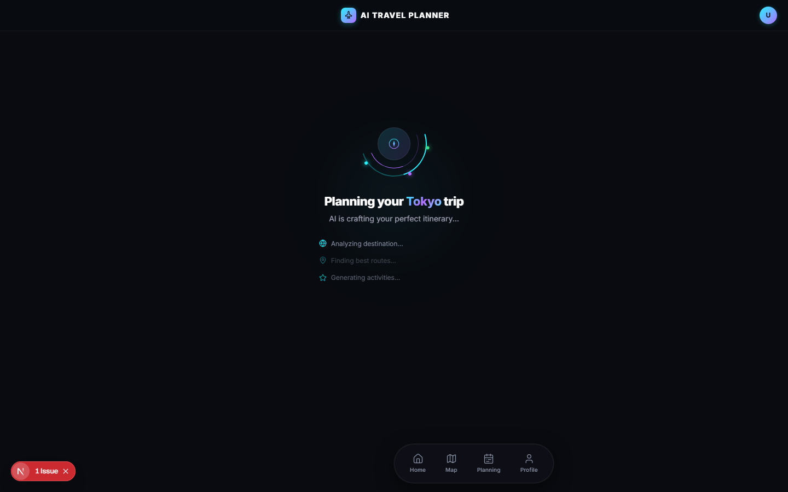 | 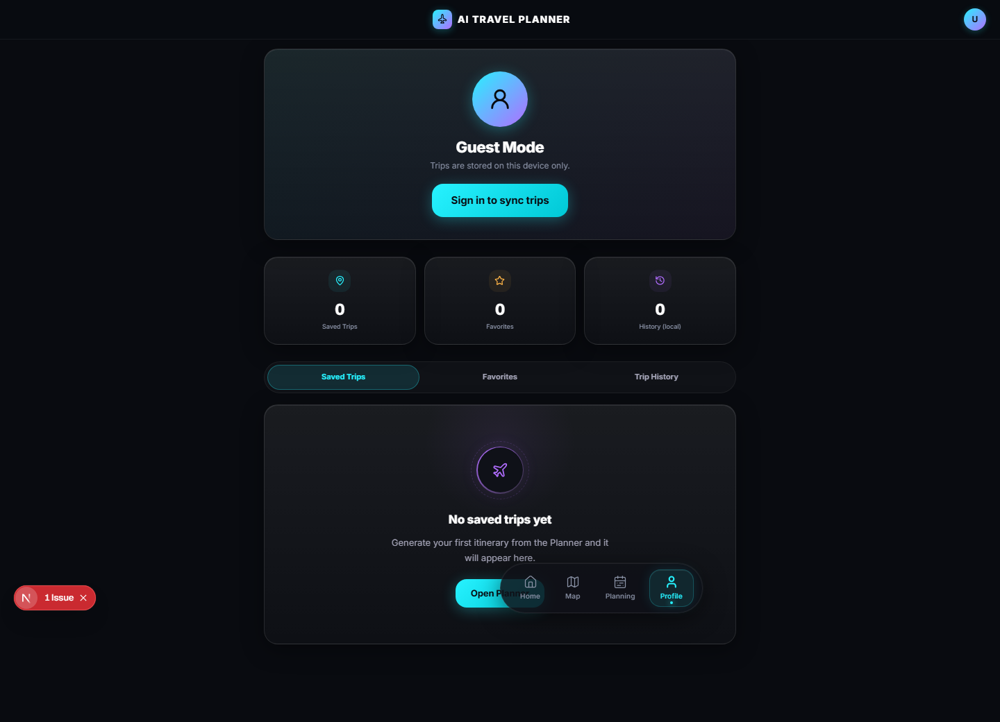 | 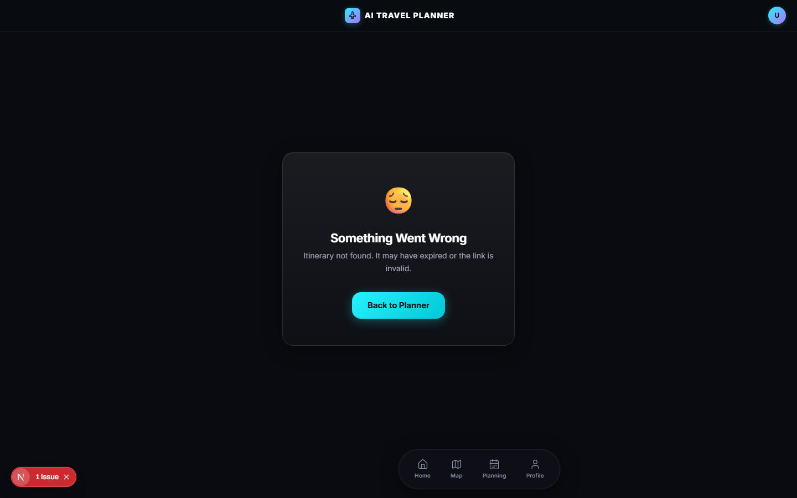 |

Also captured: [home on mobile](docs/screenshots/home-mobile.png) and the [1200×630 Open Graph card](public/og-card.png) used for social sharing.

---


## 🛠️ Tech Stack

**Core**

- **Next.js 16** (App Router, Turbopack) · **React 19** · **TypeScript** (strict)
- **Tailwind CSS v4** + a tokenized dark glassmorphism design system
- **Zustand** with persistent, versioned localStorage stores
- **Framer Motion** — animation + layout transitions

**AI & Data**

- **NVIDIA NIM** (`integrate.api.nvidia.com`) — LLM chat completions via GLM 5.2 (generation, editing, chat)
- **Open-Meteo** — free, keyless live weather
- **Leaflet + OpenStreetMap** — interactive route maps
- **Supabase** *(optional)* — auth + cloud persistence (service-role adapter for shares)

**Dev**

- ESLint (flat config) · Vitest (unit/integration) · Playwright (e2e + screenshots + perf) · `next/font` (Inter) · `lucide-react`

---

## 🏗️ Architecture

```mermaid
flowchart LR
    Q[Questionnaire\n(Zustand persisted)] -->|POST /api/generate| GEN[AI Generator]
    GEN -->|shared JSON schema| P[Parse + persist\nlocalStorage]
    P --> UI[Itinerary UI]
    UI -->|command| REF[POST /api/refine\nSurgical Editor]
    UI -->|GET /api/weather| W[Open-Meteo]
    UI -->|POST /api/share| SH[Share Store\nfile ↔ Supabase adapter]
    SH -->|public GET /share/[token]| PUB[Public page]
```

**Design decisions**

- **Client-first data flow.** The itinerary lives in a versioned, size-budgeted localStorage store (`atp:itineraries:v1`) with automatic pruning — users are never locked out by quota.
- **Storage adapter seam.** Trip sharing works with zero configuration (file store under `data/shares/`) and upgrades to Supabase (`shared_trips` with RLS) purely by setting environment variables.
- **Provider abstraction.** Generation, editing, and chat all flow through one LLM client with a strict JSON-response contract.

```
AI flow:  questionnaire → system prompt (schema) → LLM → JSON → parse → validate → persist → render
Edit flow: command + full itinerary → surgical prompt → LLM → merge-preserving diff → persist
```

---


## 🧑‍💻 Development Guide

```bash
npm run dev             # start Turbopack dev server
npm run build           # production build
npm run start           # serve the production build
npx tsc --noEmit        # type check
npm run lint            # ESLint
npm run test            # Vitest (unit + integration)
npm run test:e2e        # Playwright end-to-end
npm run test:release    # release gate vs. the production build (console/headers/a11y/responsive)
npm run test:all        # everything above
npm run screenshots     # regenerate docs/screenshots/*.png + brand icons
```

**Testing**

- **Vitest** — 85 tests covering AI parsing, budget normalization, weather mapping, share-store integrity, and rate limiting.
- **Playwright e2e** — 8 critical flows (wizard → generate → refine → weather → persistence → share → revoke) against a seeded fixture (`tests/fixtures.ts`).
- **Screenshot pipeline** — `screenshots/portfolio-shots.spec.ts` drives the real UI (including the true AI loading flow through the questionnaire) and regenerates every image in this README.
- **Perf suite** — `perf/route-bytes.spec.ts` enforces route-level bundle budgets.

**Conventions**

- Strict TypeScript everywhere; shared domain types live in `src/types/`.
- API routes: thin handlers, domain logic in `src/lib/`, errors as `{ error }` JSON.
- State: Zustand stores in `src/hooks/` with versioned persist keys (`atp:*`).
- UI: token-driven inline styles + utility classes; new shared primitives go in `components/shared/`.

---

## 📂 Project Structure

```
src/
├── app/
│   ├── api/
│   │   ├── generate/          # POST — AI itinerary generation
│   │   ├── refine/            # POST — surgical itinerary edits
│   │   ├── chat/              # POST — conversational assistant
│   │   ├── weather/           # GET  — Open-Meteo proxy + WMO mapping
│   │   ├── share/             # POST/GET/DELETE — share links
│   │   └── itineraries/[id]/  # GET  — server-side trip lookup (future)
│   ├── page.tsx               # Home: hero, quick actions, recent trips
│   ├── plan/                  # Questionnaire wizard
│   ├── itinerary/[id]/        # Trip view + report
│   ├── budget/[id]/           # Budget planner
│   ├── share/[token]/         # Public shared-trip page (server-rendered)
│   ├── profile/               # Account, saved trips, activity
│   ├── auth/                  # Login + OAuth callback
│   └── map/                   # Map explorer
├── components/
│   ├── questionnaire/         # 9 wizard steps + StepWrapper
│   ├── itinerary/             # Summary, timeline, map, weather, cards
│   ├── budget/                # Dashboard, pie chart, savings
│   ├── report/                # Cover + print-optimized sections
│   ├── share/ & sharing/      # Public view + share modal
│   ├── home/ · profile/ · auth/ · map/
│   └── shared/                # Navbar, BottomNav, Skeleton, EmptyState…
├── hooks/                     # Stores (Zustand) + data hooks
├── lib/
│   ├── ai/                    # Provider, prompts, schema, surgical editor
│   ├── sharing/               # Share validation + file store
│   ├── db/                    # Supabase share-store adapter
│   ├── budget/                # Normalization + savings logic
│   ├── weather/               # WMO mapping + anchor resolution
│   ├── trips/                 # Cloud sync / trip history
│   └── storage/               # localStorage budget + pruning
└── types/                     # Shared domain types
docs/screenshots/              # Captured UI screenshots (regenerable)
scripts/brand/                 # OG card HTML + favicon builder
```

---

## 🤖 AI Models

**Endpoint:** NVIDIA NIM — `POST https://integrate.api.nvidia.com/v1/chat/completions`

| Flow | Model | Max tokens | Config |
|---|---|---|---|
| Generation | `z-ai/glm-5.2` | 16,384 | temp 1.0 · top-p 1.0 · seed 42 |
| Surgical edit | `z-ai/glm-5.2` | 8,192 | temp 0.7 · top-p 0.9 · seed 7 |
| Chat assistant | `z-ai/glm-5.2` | 512 | temp 0.8 · top-p 0.9 |

**Prompt engineering highlights**

- A single **shared JSON schema** (`lib/ai/prompt.ts`) is embedded in both the generator and editor system prompts — the two can never drift apart.
- The editor prompt mandates **verbatim copying of untouched sections**; a merge-preserving diff restores anything the model drops or malforms.
- **Content policy:** no booking links, no precise-looking prices, JSON-only output — model responses are parsed with a resilient brace-matching extractor.
- The provider seam (`lib/ai/nvidia.ts`) means swapping the model is a one-line change.

---


## 🛡️ Production Readiness

The app ships hardened out of the box — see [PRODUCTION_READINESS.md](PRODUCTION_READINESS.md) for the full audit:

- **AI resilience** — 50 s server / 45 s client timeouts with graceful error states.
- **Request hardening** — rate limiting before body parsing, Content-Length caps (413) on all POST routes.
- **Share security** — 48-hex tokens, SHA-256-hashed revoke keys, per-IP throttling.
- **CSP & headers** — strict security headers with no `dangerouslySetInnerHTML` anywhere.
- **Storage safety** — versioned stores with quota-budgeted pruning; `/data` is gitignored.

---

## 👥 Contributors

- **You** — *initials / role* — [GitHub](https://github.com/sharma9655v) · [LinkedIn](https://www.linkedin.com/in/vashudev-sharma-bb094a398/)

Contributions welcome — open an issue or PR.

---

<div align="center">
  Made with ☕ and a strict `tsconfig` · Star it if you'd travel with it ✈️
</div>
